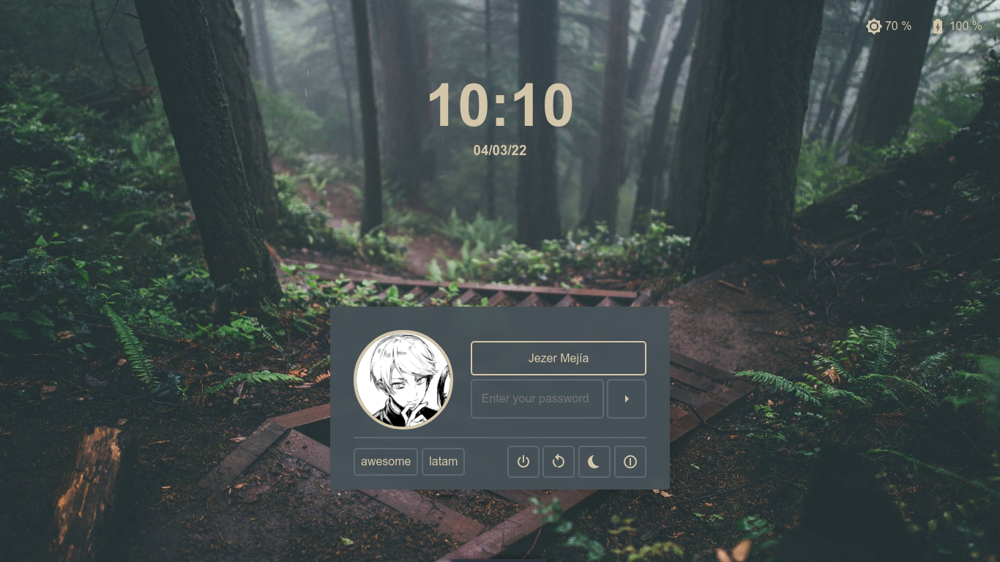

# LightDM Void Theme

I tried Void Linux and got super excited to create a lightdm theme inspired in Void.
There's actually no relation with Void Linux, as I didn't find a Void colorscheme,
so Everforest theme it's used, though the look and feel is inspired on Void Linux web page.

Additionally, this is inspired on Litarvan's theme visuals and structure.

## Screenshots

<center>

</center>

## Dependencies

- [web-greeter][web-greeter], [nody-greeter][nody-greeter] or [sea-greeter][sea-greeter]

## Build & Install

Run the next commands to build Void theme:

```sh
git clone https://github.com/JezerM/lightdm-void-theme.git
cd lightdm-void-theme
npm install
npm run build
```

Then, copy the **dist** directory into `/usr/share/web-greeter/themes/`:

```
sudo cp -r ./dist /usr/share/web-greeter/themes/lightdm-void-theme
```

Afterwards, set your theme as `lightdm-void-theme` inside
web-greeter/nody-greeter/sea-greeter's config file (`/etc/lightdm/web-greeter.yml`).

[web-greeter]: https://github.com/JezerM/web-greeter "Web Greeter"
[nody-greeter]: https://github.com/JezerM/nody-greeter "Nody Greeter"
[sea-greeter]: https://github.com/JezerM/sea-greeter "Sea Greeter"
